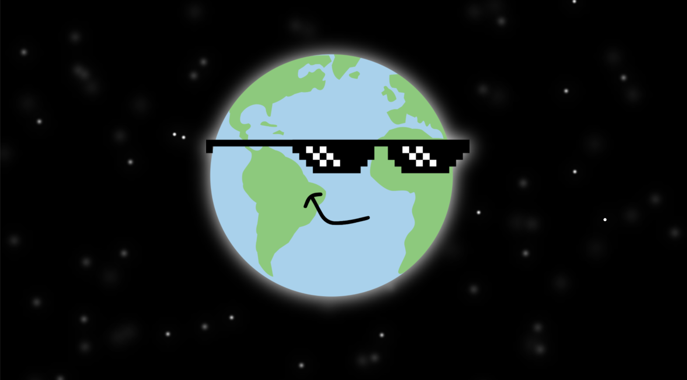

# Earth Day

Fun animation with HTML, CSS and Javascript!

Javascript creates a random number of stars, then positions and styles them with the css box-shadow property dependent on window width and height.

  See the Pen <a href="https://codepen.io/louflan/pen/abvBGZY">
  Earth Day</a> by Louise Flanagan (<a href="https://codepen.io/louflan">@louflan</a>)
  on <a href="https://codepen.io">CodePen</a>.

